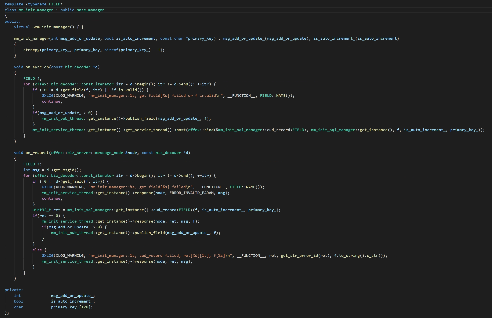

# mm_init_sub_thread

| server/client | topic                     | init时机 | 模式    |      |
| ------------- | ------------------------- | -------- | ------- | ---- |
| client        | MM_TOPIC_STRATEGY_SYNC_DB | init     | pub/sub |      |

# mm_init_pub_thread

| server/client | topic         | init时机 | 模式    |
| ------------- | ------------- | -------- | ------- |
| server        | MM_TOPIC_INIT | init     | pub/sub |

# mm_init_service_thread

| server/client | topic                 | init时机 | 模式    |
| ------------- | --------------------- | -------- | ------- |
| server        | MM_TOPIC_INIT_SERVICE | init     | req/rsp |

mm_init_biz::on_request 作为server的 set_request_callback 的回调

#  基础设施

