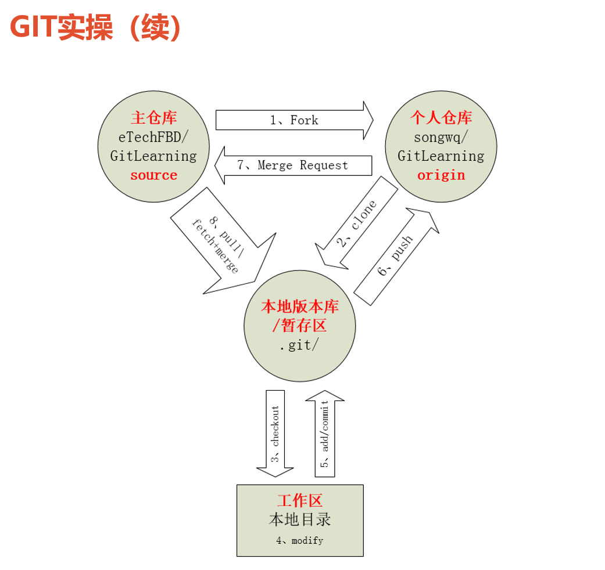

# 流程



## Step8

当我fork了一个人的repo后发现，我不能简单的`git pull`来自于源仓库的更新，只是在我自己的repo中玩耍。
 搜索了一下发现，需要先把源仓库的remote端加入进来，才能pull。

假设源仓库是`git@github.com:yychuyu/LeetCode.git`，而我fork后的仓库是`git@github.com:solomonxie/LeetCode.git`。

```shell
# 添加源仓库的remote地址，相较于自己的远端名字"origin"，给它任意起个名字："source"
git remote add source http://50.1.45.2/clzx/server_code.git
git remote -v
# 指定pull自源仓库的master分支
git pull source master

# 下载更新后自动会然后进入commit提交页面
# commit更新
# 修改有conflict的文件，然后再次commit
# ...

# 将本地的更新push到自己的remote
git push origin master
```

记住，添加了源仓库的remote后，只能pull而不能push，因为没有权限。这时候需要到github网页上，提交`pull request`，然后等待源分支的主人允许合并。

`pull`方法其实是不推荐的，因为会自动覆盖当前分支，产生冲突。还有另一种`fetch`方法，把更新下载到本地后，我们可以为它创建一个分支，然后再选择性merge到自己的master分支即可。

```shell
git fetch source master

# 切换到刚刚更新的源分支
git checkout source/master
git merge FETCH_HEAD

git commit . -m "xxxx"
```


git clone 整个仓库后使用，以下命令就可以取得该 tag 对应的代码了。 

git checkout tag_name 
但是，这时候 git 可能会提示你当前处于一个“detached HEAD" 状态。

因为 tag 相当于是一个快照，是不能更改它的代码的。

如果要在 tag 代码的基础上做修改，你需要一个分支： 

git checkout -b branch_name tag_name
这样会从 tag 创建一个分支，然后就和普通的 git 操作一样了。


如果项目上有一个后来新建的分支test，并且使用

git branch -a
看不到该远程分支：

* develop
  remotes/composer/develop
  remotes/composer/feature/194
  remotes/composer/feature/198
  remotes/composer/feature/199
  remotes/composer/feature/200
  remotes/composer/master
  remotes/origin/HEAD -> origin/develop
  remotes/origin/develop
  remotes/origin/feature/194
  remotes/origin/feature/198
  remotes/origin/feature/199
  remotes/origin/feature/200
  remotes/origin/master
直接使用命令git checkout test，出现以下错误

error: pathspec 'origin/XXX' did not match any file(s) known to git.
项目上有一个分支test，使用git branch -a看不到该远程分支，直接使用命令git checkout test报错如下：
解决方法是：

1、执行命令git fetch取回所有分支的更新

2、执行git branch -a可以看到test分支（已经更新分支信息）

3、切换分支git checkout test
————————————————
版权声明：本文为CSDN博主「DinnerHowe」的原创文章，遵循CC 4.0 BY-SA版权协议，转载请附上原文出处链接及本声明。
原文链接：https://blog.csdn.net/DinnerHowe/article/details/79082769